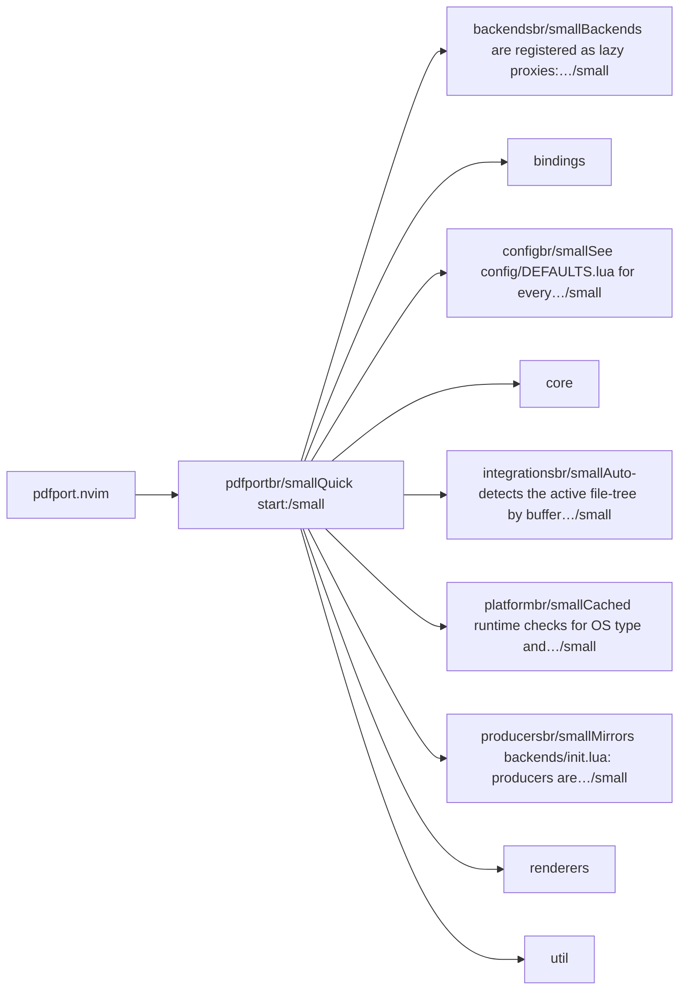
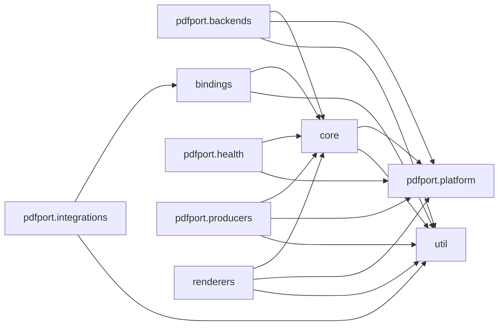

# pdfport.nvim — module map

> **Generated** by `documentation`. Do not edit by hand — run `:DocMap`
> (or `nvim --headless -l scripts/gen_map.lua`) to regenerate.

**6 modules** · 5 namespaces · 43 helper files

The [interactive map](index.html) has filtering, full descriptions and
source links; this page is the version the code host renders directly.

## Namespaces

## Dependencies

Which parts of the tree require which, rolled up to the second level.
The [interactive map](index.html)'s **Deps** view has this per module,
in both directions, with load-time and lazy requires told apart.

## Modules

| Module | Description | Fns | Docs |
|---|---|---|---|
| `pdfport` | Quick start: | 18 | [src](../../lua/pdfport/init.lua) |
| &nbsp;&nbsp;`pdfport.backends` | Backends are registered as lazy proxies: the real module (and whatever work its top-level `require`s do) is only loaded the first time the proxy's… | 3 | [src](../../lua/pdfport/backends/init.lua) |
| &nbsp;&nbsp;`bindings` |  |  |  |
| &nbsp;&nbsp;`pdfport.config` | See config/DEFAULTS.lua for every configurable key and its default value. | 2 | [src](../../lua/pdfport/config/init.lua) |
| &nbsp;&nbsp;`core` |  |  |  |
| &nbsp;&nbsp;`pdfport.integrations` | Auto-detects the active file-tree by buffer filetype and dispatches accordingly. | 2 | [src](../../lua/pdfport/integrations/init.lua) |
| &nbsp;&nbsp;`pdfport.platform` | Cached runtime checks for OS type and binary availability. | 9 | [src](../../lua/pdfport/platform/init.lua) |
| &nbsp;&nbsp;`pdfport.producers` | Mirrors backends/init.lua: producers are registered as lazy proxies, the real module is only `require`d the first time the composer's resolver walks the… | 3 | [src](../../lua/pdfport/producers/init.lua) |
| &nbsp;&nbsp;`renderers` |  |  |  |
| &nbsp;&nbsp;`util` |  |  |  |

## Drift

0 errors · 17 warnings · 27 info

| Severity | Check | Message |
|---|---|---|
| warn | `dead-see-target` | M.create: @see target 'pdfport.core.dispatcher.dispatch  Mirror shape' does not resolve to a known module or function |
| warn | `dead-see-target` | M.create: @see target 'opposite arrow (something → PDF)' does not resolve to a known module or function |
| warn | `dead-see-target` | M.dispatch: @see target 'pdfport.core.resolver.resolve  Backend selection happens here before extraction' does not resolve to a known module or function |
| warn | `dead-see-target` | is_pdf: @see target 'duplicated per-tree' does not resolve to a known module or function |
| warn | `dead-see-target` | is_pdf: @see target 'pdfport.integrations.oil  Same check' does not resolve to a known module or function |
| warn | `dead-see-target` | current_node_path: @see target 'pdfport.integrations.oil  Same-shaped helper' does not resolve to a known module or function |
| warn | `dead-see-target` | current_node_path: @see target 'filetype-specific' does not resolve to a known module or function |
| warn | `dead-see-target` | is_pdf: @see target 'duplicated per-tree' does not resolve to a known module or function |
| warn | `dead-see-target` | is_pdf: @see target 'pdfport.integrations.neotree  Same check' does not resolve to a known module or function |
| warn | `dead-see-target` | is_pdf: @see target 'pdfport.integrations.neotree  Same check' does not resolve to a known module or function |
| warn | `dead-see-target` | current_node_path: @see target 'filetype-specific' does not resolve to a known module or function |
| warn | `dead-see-target` | is_pdf: @see target 'duplicated per-tree' does not resolve to a known module or function |
| warn | `dead-see-target` | current_node_path: @see target 'pdfport.integrations.oil  Same-shaped helper' does not resolve to a known module or function |
| warn | `dead-see-target` | is_pdf: @see target 'duplicated per-tree' does not resolve to a known module or function |
| warn | `dead-see-target` | current_node_path: @see target 'filetype-specific' does not resolve to a known module or function |
| warn | `dead-see-target` | current_node_path: @see target 'pdfport.integrations.nvim_tree  Same-shaped helper' does not resolve to a known module or function |
| warn | `dead-see-target` | is_pdf: @see target 'pdfport.integrations.neotree  Same check' does not resolve to a known module or function |

27 informational findings

| Check | Message |
|---|---|
| `missing-readme` | lua/pdfport has no README.md |
| `missing-readme` | lua/pdfport/backends has no README.md |
| `missing-readme` | lua/pdfport/config has no README.md |
| `missing-readme` | lua/pdfport/integrations has no README.md |
| `missing-readme` | lua/pdfport/platform has no README.md |
| `missing-readme` | lua/pdfport/producers has no README.md |
| `unreferenced-module` | pdfport.backends.claude is required by no other file in the tree |
| `unreferenced-module` | pdfport.backends.docling is required by no other file in the tree |
| `unreferenced-module` | pdfport.backends.marker is required by no other file in the tree |
| `unreferenced-module` | pdfport.backends.ollama is required by no other file in the tree |
| `unreferenced-module` | pdfport.backends.pdfplumber is required by no other file in the tree |
| `unreferenced-module` | pdfport.backends.pdftotext is required by no other file in the tree |
| `unreferenced-module` | pdfport.backends.tesseract is required by no other file in the tree |
| `unreferenced-module` | pdfport.health is required by no other file in the tree |
| `unreferenced-module` | pdfport.producers.chromium is required by no other file in the tree |
| `unreferenced-module` | pdfport.producers.ghostscript is required by no other file in the tree |
| `unreferenced-module` | pdfport.producers.img2pdf is required by no other file in the tree |
| `unreferenced-module` | pdfport.producers.magick is required by no other file in the tree |
| `unreferenced-module` | pdfport.producers.pandoc is required by no other file in the tree |
| `unreferenced-module` | pdfport.producers.pdftk is required by no other file in the tree |
| `unreferenced-module` | pdfport.producers.qpdf is required by no other file in the tree |
| `unreferenced-module` | pdfport.producers.soffice is required by no other file in the tree |
| `unreferenced-module` | pdfport.producers.weasyprint is required by no other file in the tree |
| `unreferenced-module` | pdfport.renderers.buffer is required by no other file in the tree |
| `unreferenced-module` | pdfport.renderers.float is required by no other file in the tree |
| `unreferenced-module` | pdfport.renderers.system is required by no other file in the tree |
| `unreferenced-module` | pdfport.renderers.terminal is required by no other file in the tree |

